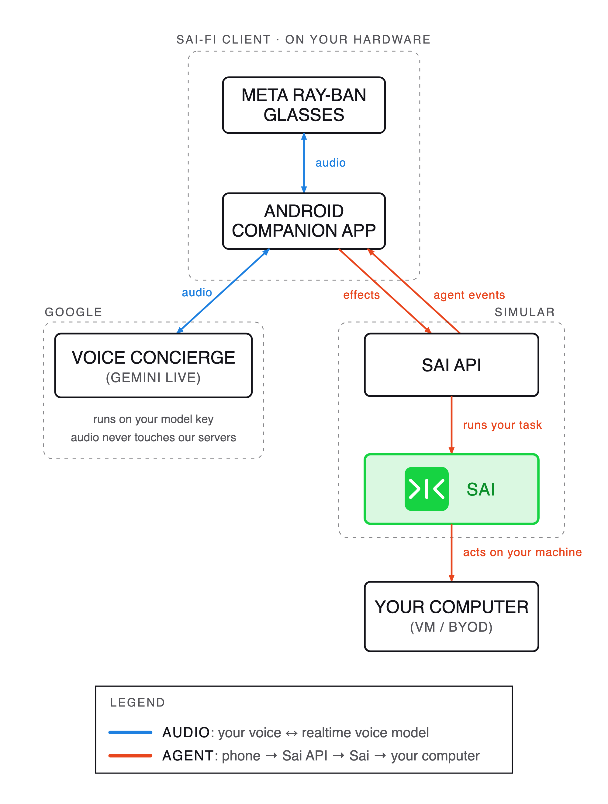

# sai-fi



A standalone phone app that puts the **Sai voice concierge** on Meta Ray-Ban glasses. Android
(`meta-android-app/`) is the shipping client; iOS (`meta-ios-app (untested on-device)/`) is the in-progress port and
**has not been tested on a physical iPhone or real glasses** (Simulator + MockDeviceKit only).

The phone runs a Gemini Live audio session **directly, with your own API key**, and runs the whole
conversation — the state machine that queues, interrupts and resolves — itself. It talks to Sai's
cloud API only to reach your agent. The glasses are the microphone, speaker and camera, reached
through Meta's Device Access Toolkit via the Meta AI companion app.

Talk to Sai hands-free, hand work to an agent running on your own machine, and hear about it when it
is done. **The voice half needs no server of ours**; the agent half needs a Sai account, because that
is someone else's computer doing real work.

**Sai API documentation:** [https://sai.work/api](https://sai.work/api)

- [`docs/DIRECTORY.md`](docs/DIRECTORY.md) — **new to the code? start here.** A one-line-per-file
  map of the whole repo, so you can find what you want without reading the tree.
- [`docs/SAI_GLASSES_APP.md`](docs/SAI_GLASSES_APP.md) — this app's architecture: modules, the two
  links, DAT platform facts, the design decisions that still constrain the code.
- [`docs/VOICE_FSM.md`](docs/VOICE_FSM.md) — **the conversation state machine this app owns.** Modes,
  the effect grammar, the admission rule, the races, and why each rule exists. Read it before changing
  anything under `fsm/`.
- [`docs/CONCIERGE_CLIENT_PROTOCOL.md`](docs/CONCIERGE_CLIENT_PROTOCOL.md) — the wire contract between
  this app and the server: the `/v1/agents/*` endpoints (the ordinary Sai API — there is no
  voice-specific one), how their stream translates into agent events, and the five tools this client
  is obliged to answer itself.
- [`docs/ON_DEVICE_CHECK.md`](docs/ON_DEVICE_CHECK.md) — **verify a build on real hardware.** Ten
  checks, each naming what it actually exercises.
- [`CHANGELOG.md`](CHANGELOG.md) — what changed in each tagged release.
- [`SECURITY.md`](SECURITY.md) — how to report a vulnerability, and where credentials live.

## Prerequisites

Each of these stops a fresh clone dead, and none of them is discoverable from an error message.

**JDK 21, from Android Studio.** Gradle 8.14.1 rejects newer JDKs with a bare `* What went wrong: 26.0.1`.

```bash
export JAVA_HOME="/Applications/Android Studio.app/Contents/jbr/Contents/Home"
```

**`local.properties`.** Copy [`meta-android-app/local.properties.example`](meta-android-app/local.properties.example)
to `meta-android-app/local.properties` and fill it in. Every key is commented there; the ones that
block a build or a call:

| Key | What it is |
| --- | --- |
| `github_token` | A GitHub PAT (classic) with `read:packages`. Meta's DAT SDK resolves from GitHub Packages, and it is on the unit-test compile classpath — without this, even `testDebugUnitTest` cannot run |
| `mwdat_application_id`, `mwdat_client_token` | Your DAT registration, from the Wearables Developer Center. Injected as manifest placeholders, never committed |
| `gemini_api_key` | **Your own Gemini API key** ([aistudio.google.com](https://aistudio.google.com/)). The app opens the Live session directly with it — there is no server-minted token, and audio never touches our servers. You pay Google for the voice half; we do not bill for it. Compiled into the APK like `presenter_key`, so a build carrying it should not be shared |
| `sai_api_url` | The Sai API base — this reaches your Sai **agent**. Defaults to `https://api.sai.simular.ai`. An empty value fails at runtime with `no sai_api_url`. The voice conversation itself needs nothing from it |
| `firebase_*`, `web_client_id` | Google sign-in. There is no `google-services.json` — these four values replace it. `web_client_id` is the OAuth **web** client, which is what Credential Manager needs for a server-verifiable ID token |
| `sai_version_tag` | Optional. Pins the app to one server revision via the `x-sai-version` header. Leave blank against production |

A missing key does **not** fail the build. It becomes an empty `BuildConfig` field and surfaces later
at runtime. `gemini_api_key` and an empty `sai_api_url` fail with a named `start failed: no …` line
rather than a network error — so fill in the whole required section.

## Build and test

**The simple path.** Open the `meta-android-app` folder in Android Studio — not the repo root; Gradle
lives one level down, and the parent will not look like a project. Fill in `local.properties`,
**File > Sync Project with Gradle Files**, plug in a phone with USB debugging, and click **Run**.
That installs and launches. It does not run the tests.

The command line does both:

```bash
export JAVA_HOME="/Applications/Android Studio.app/Contents/jbr/Contents/Home"
cd meta-android-app && ./gradlew :app:installDebug
cd meta-android-app && ./gradlew :app:testDebugUnitTest --rerun
```

`--rerun` matters. Without it the test task reports `UP-TO-DATE` from cache and verifies nothing.

CI runs the same gate on every push and PR (`.github/workflows/android.yml`) — the JVM unit tests,
including the 63-scenario FSM golden catalog, the string goldens described below, and the conversation
harness that drives a fake brain through the real gate, FSM and bridge down to a scripted agent. On-device
and by-ear checks are still manual: [`docs/ON_DEVICE_CHECK.md`](docs/ON_DEVICE_CHECK.md).

Four further tiers wake something real, so they are **off unless you ask for them** and cost money
when you do. CI never sets any of these:

```bash
# contract drift against a real cloud-api — an SSE field that changed shape, a status we don't map
SAI_LIVE_AGENT=1 ./gradlew :app:testDebugUnitTest --tests "*LiveAgent*" --rerun

# the queue and the stop button against a real agent: a second ask while the first is genuinely
# still running, then abort and new-session on the wire
SAI_LIVE_AGENT=1 ./gradlew :app:testDebugUnitTest --tests "*LiveQueueTest*" --rerun

# the real model through the real FSM, graded against the rubric (a full run takes minutes)
SAI_CONVERSATION_EVAL=1 GEMINI_API_KEY=… ./gradlew :app:testDebugUnitTest --tests "*LoopEvalTest*" --rerun

# the real model over 33 fixed transcripts, no FSM — phrasing and effect choice, graded the same way
SAI_TRANSCRIPT_EVAL=1 GEMINI_API_KEY=… ./gradlew :app:testDebugUnitTest --tests "*TranscriptEvalTest*" --rerun

# a real model AND a real agent, end to end; add SAI_PRESENTER=1 to watch it in the dashboard
SAI_DEMO=1 GEMINI_API_KEY=… ./gradlew :app:testDebugUnitTest --tests "*DemoFlowTest*" --rerun
```

The two judged tiers grade against the same rubric and see different failures, which is why both
exist: `LoopEvalTest` runs a handful of conversations through a queue that really exists;
`TranscriptEvalTest` runs 33 fixed transcripts with no FSM, so it can grade whether it SAYS the right
thing about a waiting task but not whether the task was really waiting. Narrow either with
`EVAL_ONLY="<name fragment>"`, and read `EVAL_MODEL` before reading a red — the default is a tier
below what the glasses run.

`--rerun` is not optional for any of them: Gradle does not treat environment variables as task
inputs, so a second run with different settings is UP-TO-DATE and reports success without running
anything — which looks exactly like a fast green run.

## Running it

In order. Each step fails in a way the next one cannot explain, so do not skip ahead.

1. **Fill in `local.properties`.** Without `gemini_api_key` the app starts and then logs
   `start failed: no gemini_api_key` — no call, no audio. An empty `sai_api_url` logs
   `start failed: no sai_api_url`. Without `github_token` the build cannot even resolve the DAT SDK.
2. **Register with Meta AI** (see below). The app is unusable until the glasses are registered to it,
   and only one third-party DAT app can hold a registration at a time.
3. **Install and sign in.** `./gradlew :app:installDebug`, then Google sign-in in the app — that is
   what authorises the agent half.
4. **Pick a machine.** The picker lists the VMs on your Sai account. A hibernated one is woken when
   the call binds, and Sai says so.
5. **Start the call**, and talk. The glasses' temple button mutes (tap) and ends (hold).

What you need before any of it: a Meta Ray-Ban pair paired to the Meta AI app, a Gemini API key, a
Sai account with at least one machine, and JDK 21.

## Registration

The app is unusable until it is registered. Turn on **Developer Mode** in the Meta AI app, then
register from the Wearables Developer Center and put the `APPLICATION_ID` / `CLIENT_TOKEN` in
`local.properties`.

**Only one third-party DAT app can be registered at a time** on a given account — registering this
one unregisters whatever else you had, and you will need to re-register that afterwards.

`app/sample.keystore` is tracked on purpose. It is the debug signing config, from Meta's public
sample, and a **stable debug signature is what the registration binds to**. Note that the root
`.gitignore` ignores `*.keystore` and then negates this one file specifically.

## The presenter

A demo dashboard: the live conversation, the log, call state, glasses photos, and both audio streams,
mirrored from the phone to a laptop.

```bash
cd presenter && npm install && npm run presenter -- --port 8899 --key <secret>
```

Then set `presenter_url` and `presenter_key` in `local.properties`. **DEBUG builds only**, LAN-only
plaintext `ws://`, and nothing is persisted. It can crash, be restarted, or be abandoned mid-demo
with no consequence for the call.

## Rewriting the golden fixtures

Every string the concierge speaks or shows — the nudges, the activity log, the spoken status — is
pinned byte for byte by JSON goldens in `meta-android-app/app/src/test/resources/parity/`. The tests
replay them; a reworded line fails one. That is the point: the wording is load-bearing, nearly all of
it found by hearing it fail on a real call, so a change to it should be a diff someone reviews rather
than something a user notices on the glasses.

Generation is a switched-off test, and only it writes them:

```bash
cd meta-android-app
SAI_REGEN_GOLDENS=1 ./gradlew :app:testDebugUnitTest --rerun --tests "*RegenerateGoldensTest*"
git diff app/src/test/resources/parity/   # read the wording change, then commit it
```

**Why a test rather than an ordinary Gradle task, and why the environment switch.** It needs the
unit-test classpath and the same `org.json` the ports run against. The switch is what keeps it honest:
CI never sets `SAI_REGEN_GOLDENS`. In its previous life this generator WAS an ordinary test that wrote
its own expected output, so every CI run silently rewrote the fixtures and drift became undetectable.
A golden that regenerates itself is not a golden.

**This used to cross both repositories.** The strings were implemented twice — canonically in
TypeScript in cloud-api, and here in Kotlin — and the fixtures were how the two ports were held equal.
cloud-api never rendered them at request time, so once the conversation moved onto the device its copy
existed only to generate this JSON, and the crossing between the repos was a hand-run `cp` that
nothing checked. It went stale exactly as you would expect: by 2026-08-18 the vendored voice profile
still declared an `approveAlways` tool the product had retired months earlier, so both the test that
graded it and cloud-api's eval were measuring a prompt for a feature that no longer existed. There is
one implementation now, and nothing left to vendor.

## Provenance and licensing

This app is derived from Meta's public **CameraAccess** Device Access Toolkit sample. The build
configuration and the manifest still carry Meta's copyright headers; the concierge implementation
under `meta-android-app/app/src/main/java/.../saispike/` is Simular's.

Released under the MIT licence — see [`LICENSE`](LICENSE), which carries both copyright lines. Meta's
sample is also MIT, so the two are compatible.

Security reports: [`SECURITY.md`](SECURITY.md). Releases: [`CHANGELOG.md`](CHANGELOG.md).

The two bundled fonts are **not** MIT: JetBrains Mono and Manrope are SIL OFL 1.1, which requires the
licence to travel with the font — including inside the APK. Their texts are in
[`licenses/`](licenses/README.md). Do not rename the font files; the OFL reserves the original names.
